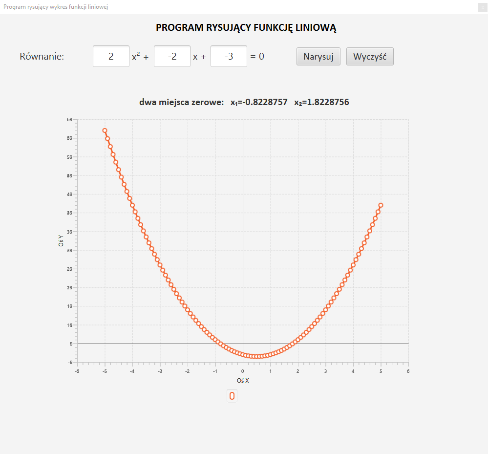

# WykresFunkcjiKwadratowej
 The program displays the graph of the quadratic function with the zeros

## Table of Contents
* [General Info](#general-information)
* [Technologies Used](#technologies-used)
* [Features](#features)
* [Screenshots](#screenshots)
* [Project Status](#project-status)
* [Contact](#contact)

## General Information
- Provide general information about your project here.

## Technologies Used
- JavaFX
- SceneBuilder

## Features

## Screenshot

## Project Status
Project is: _no longer being worked on_.
Praca na zaliczenie przedmiotu w technikum.

## Contact
Created by [@KamilMarshal](https://github.com/KamilMarshal/) - feel free to contact me!

